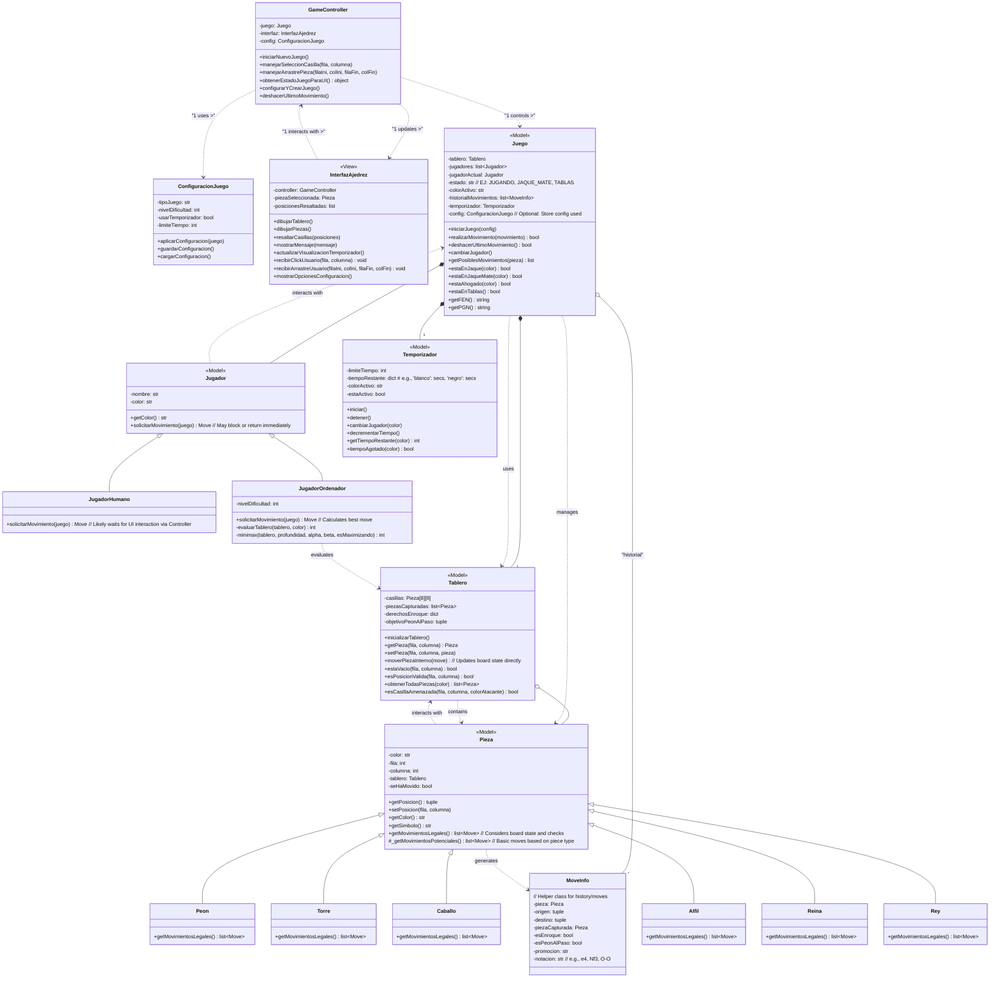

```mermaid
classDiagram
    direction TD

    class ConfiguracionJuego {
        -tipoJuego: str
        -nivelDificultad: int
        -usarTemporizador: bool
        -limiteTiempo: int
        +aplicarConfiguracion(juego)
        +guardarConfiguracion()
        +cargarConfiguracion()
    }

    class GameController {
        -juego: Juego
        -interfaz: InterfazAjedrez
        -config: ConfiguracionJuego
        +iniciarNuevoJuego()
        +manejarSeleccionCasilla(fila, columna)
        +manejarArrastrePieza(filaIni, colIni, filaFin, colFin)
        +obtenerEstadoJuegoParaUI() object
        +configurarYCrearJuego()
        +deshacerUltimoMovimiento()
    }

    class InterfazAjedrez {
        <<View>>
        -controller: GameController
        -piezaSeleccionada: Pieza
        -posicionesResaltadas: list
        +dibujarTablero()
        +dibujarPiezas()
        +resaltarCasillas(posiciones)
        +mostrarMensaje(mensaje)
        +actualizarVisualizacionTemporizador()
        +recibirClickUsuario(fila, columna) void
        +recibirArrastreUsuario(filaIni, colIni, filaFin, colFin) void
        +mostrarOpcionesConfiguracion()
    }

    class Juego {
        <<Model>>
        -tablero: Tablero
        -jugadores: list~Jugador~
        -jugadorActual: Jugador
        -estado: str  // EJ: JUGANDO, JAQUE_MATE, TABLAS
        -colorActivo: str
        -historialMovimientos: list~MoveInfo~
        -temporizador: Temporizador
        -config: ConfiguracionJuego  // Optional: Store config used
        +iniciarJuego(config)
        +realizarMovimiento(movimiento) bool
        +deshacerUltimoMovimiento() bool
        +cambiarJugador()
        +getPosiblesMovimientos(pieza) list
        +estaEnJaque(color) bool
        +estaEnJaqueMate(color) bool
        +estaAhogado(color) bool
        +estaEnTablas() bool
        +getFEN() string
        +getPGN() string
    }

    class Tablero {
        <<Model>>
        -casillas: Pieza[8][8]
        -piezasCapturadas: list~Pieza~
        -derechosEnroque: dict
        -objetivoPeonAlPaso: tuple
        +inicializarTablero()
        +getPieza(fila, columna) Pieza
        +setPieza(fila, columna, pieza)
        +moverPiezaInterno(move) // Updates board state directly
        +estaVacio(fila, columna) bool
        +esPosicionValida(fila, columna) bool
        +obtenerTodasPiezas(color) list~Pieza~
        +esCasillaAmenazada(fila, columna, colorAtacante) bool
    }

    class Pieza {
        <<Model>>
        <<abstract>>
        -color: str
        -fila: int
        -columna: int
        -tablero: Tablero
        -seHaMovido: bool
        +getPosicion() tuple
        +setPosicion(fila, columna)
        +getColor() str
        +getSimbolo() str
        +getMovimientosLegales() list~Move~ // Considers board state and checks
        #_getMovimientosPotenciales() list~Move~ // Basic moves based on piece type
    }

    class Peon { +getMovimientosLegales() list~Move~ }
    class Torre { +getMovimientosLegales() list~Move~ }
    class Caballo { +getMovimientosLegales() list~Move~ }
    class Alfil { +getMovimientosLegales() list~Move~ }
    class Reina { +getMovimientosLegales() list~Move~ }
    class Rey { +getMovimientosLegales() list~Move~ }

    class Jugador {
        <<Model>>
        <<abstract>>
        -nombre: str
        -color: str
        +getColor() str
        +solicitarMovimiento(juego) Move // May block or return immediately
    }

    class JugadorHumano {
        +solicitarMovimiento(juego) Move // Likely waits for UI interaction via Controller
    }

    class JugadorOrdenador {
        -nivelDificultad: int
        +solicitarMovimiento(juego) Move // Calculates best move
        -evaluarTablero(tablero, color) int
        -minimax(tablero, profundidad, alpha, beta, esMaximizando) int
    }

    class Temporizador {
        <<Model>>
        -limiteTiempo: int
        -tiempoRestante: dict # e.g., 'blanco': secs, 'negro': secs
        -colorActivo: str
        -estaActivo: bool
        +iniciar()
        +detener()
        +cambiarJugador(color)
        +decrementarTiempo()
        +getTiempoRestante(color) int
        +tiempoAgotado(color) bool
    }

    class MoveInfo { // Helper class for history/moves
       -pieza: Pieza
       -origen: tuple
       -destino: tuple
       -piezaCapturada: Pieza
       -esEnroque: bool
       -esPeonAlPaso: bool
       -promocion: str
       -notacion: str // e.g., e4, Nf3, O-O
    }

    %% Relationships
    GameController ..> ConfiguracionJuego : "1 uses >"
    GameController ..> Juego : "1 controls >"
    GameController ..> InterfazAjedrez : "1 updates >"
    InterfazAjedrez ..> GameController : "1 interacts with >"

    Juego *-- "1" Tablero
    Juego *-- "2" Jugador
    Juego *-- "1" Temporizador
    Juego o-- "*" MoveInfo : "historial"

    Tablero o-- "0..64" Pieza
    Pieza <|-- Peon
    Pieza <|-- Torre
    Pieza <|-- Caballo
    Pieza <|-- Alfil
    Pieza <|-- Reina
    Pieza <|-- Rey

    Jugador <|-- JugadorHumano
    Jugador <|-- JugadorOrdenador

    %% Dependencies between model components
    Juego ..> Pieza : manages
    Juego ..> Tablero : uses
    Pieza ..> Tablero : interacts with
    Pieza ..> MoveInfo : generates
    Tablero ..> Pieza : contains
    Jugador ..> Juego : interacts with
    JugadorOrdenador ..> Tablero : evaluates

``` 